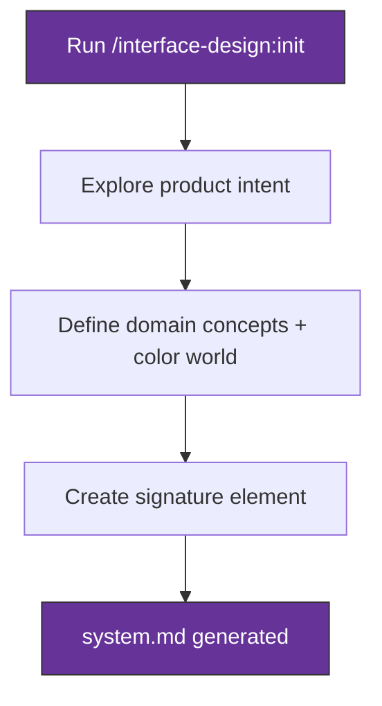
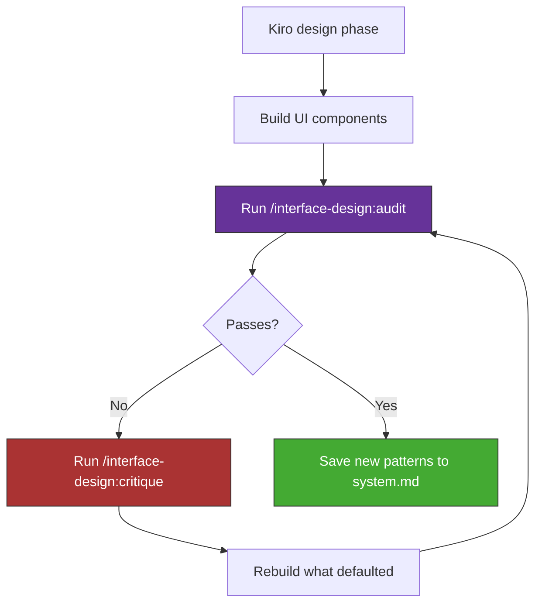
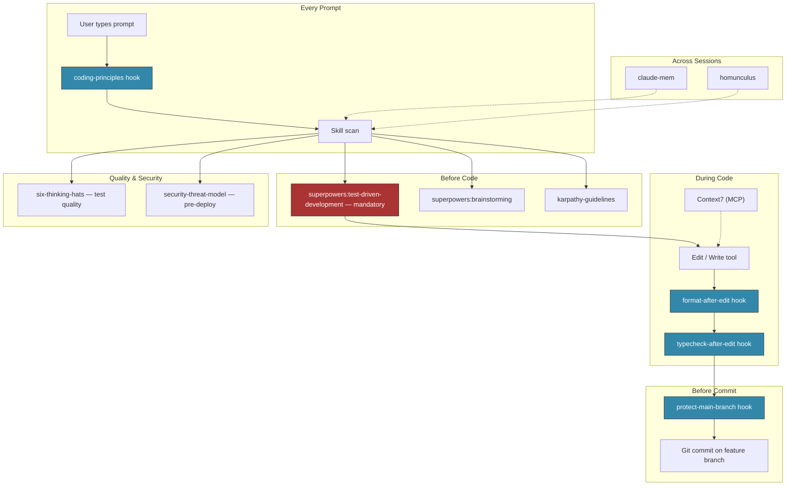

# Agentic Coding Workflow — Installation Guide

A spec-driven, human-gated development workflow for Claude Code. Design before code, tests before implementation, humans approve at every gate. This guide walks you through installing the full pipeline in your own project, using components from this repository as the source to copy from.

This projects spec-driven core is a fork of gotalab’s project, originally licensed under the MIT License.

---

## Table of Contents

- [The Full Pipeline](#the-full-pipeline)
- [Installation](#installation)
- [Pipeline Phases in Detail](#pipeline-phases-in-detail)
- [The Design Craft Pipeline](#the-design-craft-pipeline)
- [The Automation Layer](#the-automation-layer)
- [Rules & Standards](#rules--standards)
- [Quick Reference Card](#quick-reference-card)

---

## The Full Pipeline

Every feature follows the same flow. Human approval gates separate each phase — Claude cannot advance without explicit sign-off.

```mermaid
flowchart LR
    Idea --> IntentExplore["Intent Explore"]
    IntentExplore -->|approve| Requirements
    IntentExplore -.->|optional| Brainstorming
    Brainstorming -.-> Requirements
    Requirements -->|approve| Design
    Design -->|approve| Tasks
    Tasks --> Implementation
    Implementation --> Validation
    Validation -.->|optional| Simplify["code-simplifier"]
    Validation -.->|optional| DesignAudit["interface-design:audit"]
    Validation --> Merge
    Simplify --> Merge
    DesignAudit --> Merge

    style IntentExplore fill:#4a3,stroke:#333,color:#fff
    style Brainstorming fill:#666,stroke:#333,color:#fff
    style Requirements fill:#38a,stroke:#333,color:#fff
    style Design fill:#38a,stroke:#333,color:#fff
    style Tasks fill:#38a,stroke:#333,color:#fff
    style Implementation fill:#a33,stroke:#333,color:#fff
    style Validation fill:#a83,stroke:#333,color:#fff
    style Simplify fill:#666,stroke:#333,color:#fff
    style DesignAudit fill:#666,stroke:#333,color:#fff
    style Merge fill:#4a3,stroke:#333,color:#fff
```



**Why gates matter:** Without explicit approval between phases, an AI agent can build the wrong thing very quickly. Gates force alignment on the _Why_ and _what_ before investing in _how_.

**Entry point hierarchy:** Intent Explore (recommended) → Spec Init (quick-start). Stronger grounding produces better requirements downstream.

---

## Installation

Adopt this workflow incrementally. Steps 1–4 give you the minimum viable pipeline. Steps 5–9 add automation, quality enforcement, and design craft.

### Prerequisites

- [Claude Code](https://docs.anthropic.com/en/docs/claude-code) installed and configured
- A project repository where you want to use this workflow

### Step 1: Install Claude Code Plugins

These plugins provide skills and cross-session capabilities. Install them via Claude Code's plugin system (`/install-plugin`).

| Plugin             | Purpose                                                |
| ------------------ | ------------------------------------------------------ |
| `superpowers`      | TDD, systematic debugging, brainstorming, verification |
| `code-simplifier`  | Post-implementation code cleanup                       |
| `interface-design` | Design system management (optional — skip if no UI)    |
| `claude-mem`       | Cross-session semantic memory                          |
| `homunculus`       | Instinct evolution across sessions                     |
| `context7`         | MCP server for up-to-date library documentation        |

### Step 2: Copy Kiro Commands

The spec pipeline is driven by 12 slash commands. Copy them into your project:

```bash
cp -r workflows/cc-ssd-custom/.claude/commands/kiro/ <your-project>/.claude/commands/kiro/
```

Source: [`.claude/commands/kiro/`](./.claude/commands/kiro/)

| Command                | Purpose                          |
| ---------------------- | -------------------------------- |
| `intent-explore.md`    | Deep intent exploration          |
| `spec-init.md`         | Quick-start spec initialization  |
| `spec-requirements.md` | Requirements generation (EARS)   |
| `spec-design.md`       | Technical design                 |
| `spec-tasks.md`        | Task breakdown                   |
| `spec-impl.md`         | Implementation execution         |
| `validate-gap.md`      | Requirements ↔ design gap check |
| `validate-design.md`   | GO/NO-GO design quality gate     |
| `validate-impl.md`     | Implementation validation        |
| `spec-status.md`       | Progress dashboard               |
| `steering.md`          | View/update steering documents   |
| `steering-custom.md`   | Create custom steering documents |

### Step 3: Copy Kiro Rules & Templates

Rules govern how the spec pipeline generates artifacts. Templates define the output format.

```bash
cp -r workflows/cc-ssd-custom/.kiro/settings/rules/ <your-project>/.kiro/settings/rules/
cp -r workflows/cc-ssd-custom/.kiro/settings/templates/ <your-project>/.kiro/settings/templates/
```

Source: [`.kiro/settings/`](./.kiro/settings/)

Includes:

- **9 rules** — design discovery, EARS format, gap analysis, task generation, steering principles
- **15 templates** — spec templates (requirements, design, tasks, research), steering templates (product, tech, structure), and 7 custom steering templates (API, auth, database, deployment, error handling, security, testing)

### Step 4: Copy the CLAUDE.md Template

The project-level `CLAUDE.md` configures Claude Code to follow this workflow.

```bash
cp workflows/cc-ssd-custom/CLAUDE.md <your-project>/CLAUDE.md
```

Source: [`CLAUDE.md`](./CLAUDE.md)

Edit to match your project — update the spec language, add project-specific guidelines, and configure your stack commands.

### Step 5: Set Up Hooks

Hooks fire automatically during Claude Code sessions. Copy the ones you need:

```bash
# Required: prevents direct commits to main
cp -r hooks/protect-main-branch/ <your-project>/.claude/hooks/

# Recommended: injects coding principles into every prompt
cp -r hooks/coding-principles/ <your-project>/.claude/hooks/

# Optional: auto-format after edits (requires prettier/black)
cp -r hooks/format-on-edit/ <your-project>/.claude/hooks/

# Optional: type-check after TypeScript edits
cp -r hooks/typecheck-after-edit/ <your-project>/.claude/hooks/
```

Then register them in your Claude Code settings (`~/.claude/settings.json`). See each hook's README for configuration details.

Source: [`hooks/`](../../hooks/)

| Hook                                                        | Trigger                    | Purpose                                                   |
| ----------------------------------------------------------- | -------------------------- | --------------------------------------------------------- |
| [`protect-main-branch`](../../hooks/protect-main-branch/)   | `PreToolUse` (Bash)        | Blocks `git commit` and `git push --force` on main/master |
| [`coding-principles`](../../hooks/coding-principles/)       | `UserPromptSubmit`         | Injects DRY/YAGNI/KISS principles into every prompt       |
| [`format-on-edit`](../../hooks/format-on-edit/)             | `PostToolUse` (Edit/Write) | Runs prettier or black on the edited file                 |
| [`typecheck-after-edit`](../../hooks/typecheck-after-edit/) | `PostToolUse` (Edit/Write) | Runs `tsc --noEmit` after `.ts/.tsx` edits                |

### Step 6: Copy Skills

Skills are invoked by Claude when relevant. Copy any that match your stack:

```bash
# Intent exploration (recommended — powers the /kiro:intent-explore command)
cp -r skills/productmanagement-skills/intent-explorer/ <your-project>/.claude/skills/

# Coding guidelines (recommended for all projects)
cp -r skills/agentic-skills/karpathy-guidelines/ <your-project>/.claude/skills/

# Test quality analysis
cp -r skills/testing-skills/six-thinking-hats/ <your-project>/.claude/skills/

# Security threat modeling
cp -r skills/security-skills/security-threat-model/ <your-project>/.claude/skills/

# Frontend patterns (skip if no UI)
cp -r skills/frontend-skills/frontend-patterns/ <your-project>/.claude/skills/
cp -r skills/frontend-skills/vercel-react-best-practices/ <your-project>/.claude/skills/
```

Source: [`skills/`](../../skills/)

| Skill                                                                                      | When                                              |
| ------------------------------------------------------------------------------------------ | ------------------------------------------------- |
| [`intent-explorer`](../../skills/productmanagement-skills/intent-explorer/)                | Intent exploration before spec phases             |
| [`karpathy-guidelines`](../../skills/agentic-skills/karpathy-guidelines/)                  | Writing code (reduces common LLM coding mistakes) |
| [`six-thinking-hats`](../../skills/testing-skills/six-thinking-hats/)                      | Test quality analysis, test strategy design       |
| [`security-threat-model`](../../skills/security-skills/security-threat-model/)             | Pre-deployment, security-sensitive features       |
| [`frontend-patterns`](../../skills/frontend-skills/frontend-patterns/)                     | Building UI components                            |
| [`vercel-react-best-practices`](../../skills/frontend-skills/vercel-react-best-practices/) | React/Next.js development                         |

### Step 7: Copy Rules

Rules are auto-loaded from `.claude/rules/` — no invocation needed.

```bash
# Generic rules (recommended for all projects)
cp -r rules/generic-rules/ <your-project>/.claude/rules/

# Project-specific rule templates (adapt to your stack)
cp -r rules/project-rules/ <your-project>/.claude/rules/
```

Source: [`rules/`](../../rules/)

The [`rules/global/`](../../rules/global/) directory contains templates for user-wide rules (`~/.claude/rules/`). These apply across all projects — copy and adapt the ones you need.

### Step 8: Copy Custom Agents

Custom agent definitions extend Claude Code with specialized roles:

```bash
cp agents/security-reviewer.md <your-project>/.claude/agents/
cp agents/architect.md <your-project>/.claude/agents/
```

Source: [`agents/`](../../agents/)

| Agent                                                       | Purpose                                          |
| ----------------------------------------------------------- | ------------------------------------------------ |
| [`security-reviewer.md`](../../agents/security-reviewer.md) | Security vulnerability detection and remediation |
| [`architect.md`](../../agents/architect.md)                 | System design and architectural decisions        |

### Step 9: Create Steering Documents

Steering documents are your project's persistent memory — loaded into every spec phase. Create them using the included templates as a starting point:

```bash
mkdir -p <your-project>/.kiro/steering/
```

Then either run `/kiro:steering` to create them interactively, or copy and adapt the templates:

Source: [`.kiro/settings/templates/steering/`](./.kiro/settings/templates/steering/)

| Document       | Purpose                                   |
| -------------- | ----------------------------------------- |
| `product.md`   | Product vision, JTBD, user personas       |
| `tech.md`      | Stack decisions, architecture constraints |
| `structure.md` | Codebase organization, file conventions   |

Use `/kiro:steering-custom {topic}` to create additional steering documents. Templates for 7 custom topics (API standards, authentication, database, deployment, error handling, security, testing) are included.

### Step 10: Bootstrap Design System (Optional)

If your project has a UI, bootstrap a design system:

1. Install the `interface-design` plugin (Step 1)
2. Run `/interface-design:init` — creates `.interface-design/system.md` with visual tokens
3. Run `/kiro:steering-custom ux` — creates `.kiro/steering/ux.md` for interaction patterns

The visual tokens define _how things look_. The UX steering defines _how things behave_. Both are loaded into every spec phase via the Kiro steering system.

---

## Pipeline Phases in Detail

### 1. Grounding (Intent Explore → Spec Init)

Two entry points. Intent exploration produces grounded requirements; spec init is the fast path.

#### Intent Explore (recommended)

Deep exploration of user intent, outcomes, and constraints before formalizing anything. Produces `intent-spec.md` — the grounding artifact that feeds all downstream phases. Quick mode (~6-8 questions) for well-scoped changes, Deep mode (~15-20) for ambiguous or high-stakes work.

|               |                                                                    |
| ------------- | ------------------------------------------------------------------ |
| **Command**   | `/kiro:intent-explore "description"`                               |
| **Output**    | `.kiro/specs/{feature}/intent-spec.md`                             |
| **Gate**      | Human reviews intent spec, decides if the problem is worth solving |
| **Spec file** | [`intent-explore.md`](./.claude/commands/kiro/intent-explore.md)   |

After intent exploration, proceed to `/kiro:spec-init` (which detects `intent-spec.md` and skips the grounding prompt).

#### Spec Init (quick-start)

Use `/kiro:spec-init` when requirements are well-understood and grounding can be skipped. It will prompt to run intent-explore if no `intent-spec.md` exists.

|               |                                                                      |
| ------------- | -------------------------------------------------------------------- |
| **Command**   | `/kiro:spec-init "description"`                                      |
| **Output**    | `.kiro/specs/{feature}/spec.json` + `requirements.md`                |
| **Gate**      | Human decides whether to proceed ungrounded or run exploration first |
| **Spec file** | [`spec-init.md`](./.claude/commands/kiro/spec-init.md)               |

After either entry point, optionally run the `superpowers:brainstorming` skill to explore implementation approaches before committing to requirements.

### 2. Requirements

Translates the job stories into formal requirements using EARS syntax (Event-Action-Response-State). Creates testable acceptance criteria.

|               |                                                                        |
| ------------- | ---------------------------------------------------------------------- |
| **Command**   | `/kiro:spec-requirements`                                              |
| **Output**    | `.kiro/specs/{feature}/requirements.md`                                |
| **Gate**      | Human approves requirements completeness                               |
| **Spec file** | [`spec-requirements.md`](./.claude/commands/kiro/spec-requirements.md) |

### 3. Design

Technical design driven by the requirements. Produces component architecture, data model changes, API contracts, and file-level implementation plan.

|               |                                                                                                  |
| ------------- | ------------------------------------------------------------------------------------------------ |
| **Command**   | `/kiro:spec-design`                                                                              |
| **Output**    | `.kiro/specs/{feature}/design.md`                                                                |
| **Gate**      | Human approves technical approach. Optional: `/kiro:validate-design` for automated quality check |
| **Spec file** | [`spec-design.md`](./.claude/commands/kiro/spec-design.md)                                       |

Optional gap analysis between requirements and design: `/kiro:validate-gap`.

### 4. Tasks

Breaks the design into ordered implementation tasks. Each task is a self-contained unit of work with clear inputs and outputs.

|               |                                                          |
| ------------- | -------------------------------------------------------- |
| **Command**   | `/kiro:spec-tasks`                                       |
| **Output**    | `.kiro/specs/{feature}/tasks.md`                         |
| **Gate**      | Human approves task breakdown and ordering               |
| **Spec file** | [`spec-tasks.md`](./.claude/commands/kiro/spec-tasks.md) |

Key rules governing task generation:

- **Parallel analysis** — Tasks safe to run concurrently (no shared data, files, or approvals) are marked `(P)` immediately after the task number (e.g., `- [ ] 2.1 (P) Build background worker`). Pass `--sequential` to disable.
- **Documentation gate** — Whether a doc task is included is determined by 4-test reasoning (Necessity, Redundancy, Form, Maintainability). Tasks that pass are `- [ ]` (required); marginal cases are `- [ ]*` (optional); clear failures are omitted.
- **Optional coverage** — `- [ ]*` also marks deferrable test work (e.g., baseline rendering tests) when functional coverage is already guaranteed and MVP delivery is prioritized. Never applies to implementation or integration-critical verification.
- **Flexible sizing** — No fixed sub-task count. Logical grouping determines structure; sub-tasks run 1–3 hours each.
- **Container collapse** — If a major task would contain only one actionable sub-task, the sub-task is promoted to the major level. Container descriptions stay brief and don't duplicate their children's detail bullets.

### 5. Implementation

Executes tasks sequentially with TDD enforcement. Creates a feature branch, writes failing tests first, then implementation.

|               |                                                        |
| ------------- | ------------------------------------------------------ |
| **Command**   | `/kiro:spec-impl {feature} [task-numbers]`             |
| **Output**    | Working code on a feature branch                       |
| **Gate**      | Tests pass, type-check clean, human reviews PR         |
| **Spec file** | [`spec-impl.md`](./.claude/commands/kiro/spec-impl.md) |

### 6. Validation

Validates the implementation against the original requirements. Checks that all acceptance criteria are met.

|               |                                                                |
| ------------- | -------------------------------------------------------------- |
| **Command**   | `/kiro:validate-impl`                                          |
| **Output**    | Validation report                                              |
| **Gate**      | Human reviews, merges PR                                       |
| **Spec file** | [`validate-impl.md`](./.claude/commands/kiro/validate-impl.md) |

### 7. Polish (optional)

Two independent refinement passes that run after formal validation. Neither is a gate — skip either or both. They can run in parallel.

**Code simplification** — Removes duplication, flattens unnecessary abstractions, and improves naming without changing behavior. Run after any implementation that touched multiple files or introduced new patterns.

|            |                                                                                |
| ---------- | ------------------------------------------------------------------------------ |
| **Skill**  | `code-simplifier`                                                              |
| **When**   | After validation, when the implementation added complexity or left duplication |
| **Output** | Cleaner code on the same branch, ready to merge                                |

**Design audit** — Validates UI components against the design system tokens in `.interface-design/system.md`. Catches raw Tailwind values, spacing violations, and components that lack product identity.

|            |                                                                                              |
| ---------- | -------------------------------------------------------------------------------------------- |
| **Skill**  | `/interface-design:audit`                                                                    |
| **When**   | After any feature that added or modified UI components                                       |
| **Output** | List of violations; follow with `/interface-design:critique` if non-trivial issues are found |

### Supporting Commands

| Command                              | Purpose                                                                                      |
| ------------------------------------ | -------------------------------------------------------------------------------------------- |
| `/kiro:intent-explore "description"` | Recommended entry — deep intent exploration producing `intent-spec.md`                       |
| `/kiro:spec-init "description"`      | Quick-start path — initializes spec (prompts to run intent-explore if no grounding artifact) |
| `/kiro:spec-status {feature}`        | Live progress dashboard for any spec                                                         |
| `/kiro:steering`                     | View/update project steering documents                                                       |
| `/kiro:steering-custom {topic}`      | Create a custom steering document                                                            |
| `/kiro:validate-gap`                 | Gap analysis between requirements and design                                                 |
| `/kiro:validate-design`              | Automated GO/NO-GO design quality gate                                                       |

---

## The Design Craft Pipeline

Runs parallel to the spec pipeline. Ensures UI work is grounded in intentional design decisions rather than framework defaults.

### First-Time Setup



### Per-Feature Flow



### Two-Directory Pattern

The design system is split across two locations with distinct scopes:

| Location                      | Scope                | Contains                                                |
| ----------------------------- | -------------------- | ------------------------------------------------------- |
| `.interface-design/system.md` | Visual tokens        | Colors, spacing, radius, typography, elevation, shadows |
| `.kiro/steering/ux.md`        | Interaction patterns | Navigation, feedback, animations, responsive behavior   |

The visual tokens define _how things look_. The UX steering defines _how things behave_. Both are loaded into every spec phase via the Kiro steering system. Create these using Step 10 of the [Installation](#step-10-bootstrap-design-system-optional) guide.

### Design Skill Commands

| Command                      | When              | Purpose                                       |
| ---------------------------- | ----------------- | --------------------------------------------- |
| `/interface-design:init`     | Project start     | Bootstrap design system from product intent   |
| `/interface-design:extract`  | Existing code     | Pull patterns from code into `system.md`      |
| `/interface-design:audit`    | After building UI | Validate code against design tokens           |
| `/interface-design:critique` | After audit fails | Post-build craft review with rebuild guidance |

### Craft Quality Checks

These heuristics catch defaulted or unconsidered design decisions:

- **Swap test** — Could another app use this exact component? If yes, it lacks product identity.
- **Squint test** — Blur the screen. Can you still identify the hierarchy and primary action?
- **Signature test** — Does the design include the project's signature element?
- **Token test** — Are all values (colors, spacing, radius) sourced from `system.md`?

---

## The Automation Layer

What makes the workflow agentic: hooks fire automatically, skills inject discipline, cross-session memory provides continuity.



### Component Reference

#### Hooks

Shell scripts that fire automatically on tool use. Registered in `~/.claude/settings.json`. See [Installation Step 5](#step-5-set-up-hooks) for setup.

| Hook                                                        | Trigger                    | Purpose                                                   |
| ----------------------------------------------------------- | -------------------------- | --------------------------------------------------------- |
| [`protect-main-branch`](../../hooks/protect-main-branch/)   | `PreToolUse` (Bash)        | Blocks `git commit` and `git push --force` on main/master |
| [`format-on-edit`](../../hooks/format-on-edit/)             | `PostToolUse` (Edit/Write) | Runs prettier or black on the edited file                 |
| [`typecheck-after-edit`](../../hooks/typecheck-after-edit/) | `PostToolUse` (Edit/Write) | Runs `tsc --noEmit` after any `.ts/.tsx` file edit        |
| [`coding-principles`](../../hooks/coding-principles/)       | `UserPromptSubmit`         | Injects DRY/YAGNI/KISS principles into every prompt       |

#### Mandatory Skills

These skills are blocking requirements — Claude must invoke them before writing code. Configured in `CLAUDE.md`.

| Skill                                 | Trigger                                               | Enforcement                                                      |
| ------------------------------------- | ----------------------------------------------------- | ---------------------------------------------------------------- |
| [`superpowers:test-driven-development`](https://github.com/obra/superpowers) | Before any Edit/Write for features, bugs, refactoring | RED → GREEN → REFACTOR. No exceptions for "simple" or "low risk" |
| [`superpowers:systematic-debugging`](https://github.com/obra/superpowers)    | Before proposing any fix for bugs or test failures    | Evidence-based root cause analysis before any code change        |

#### Advisory Skills

Invoked when relevant (the "1% rule": even 1% chance of relevance = invoke it). See [Installation Step 6](#step-6-copy-skills) for setup.

| Skill                                                                                      | When                                            |
| ------------------------------------------------------------------------------------------ | ----------------------------------------------- |
| [`intent-explorer`](../../skills/productmanagement-skills/intent-explorer/)                | Intent exploration before spec phases           |
| [`superpowers:brainstorming`](https://github.com/obra/superpowers)                                                                | Before creative or exploratory work             |
| [`karpathy-guidelines`](../../skills/agentic-skills/karpathy-guidelines/)                  | When writing code (reduces common LLM mistakes) |
| [`vercel-react-best-practices`](../../skills/frontend-skills/vercel-react-best-practices/) | When writing React/Next.js components           |
| [`frontend-patterns`](../../skills/frontend-skills/frontend-patterns/)                     | When building UI components                     |
| [`six-thinking-hats`](../../skills/testing-skills/six-thinking-hats/)                      | Test quality analysis, test strategy design     |
| [`security-threat-model`](../../skills/security-skills/security-threat-model/)             | Pre-deployment, security-sensitive features     |

#### Design Skills

| Skill                       | When                                            |
| --------------------------- | ----------------------------------------------- |
| `interface-design:init`     | Bootstrap design system from product intent     |
| `interface-design:audit`    | Validate code against design tokens             |
| `interface-design:critique` | Post-build craft review + rebuild guidance      |
| `interface-design:extract`  | Pull patterns from existing code into system.md |

#### Cross-Session Memory

| Plugin       | Purpose                                                                                |
| ------------ | -------------------------------------------------------------------------------------- |
| `claude-mem` | Semantic search over past decisions, observations, patterns. Survives across sessions. |
| `homunculus` | Evolves instincts from observed work patterns. Detects recurring themes.               |

#### Code Intelligence (MCP Servers)

| Server     | Purpose                                                       |
| ---------- | ------------------------------------------------------------- |
| `Context7` | Up-to-date library documentation for any framework or package |

---

## Rules & Standards

Coding rules are loaded automatically via `.claude/rules/`. They enforce consistency without requiring manual invocation. See [Installation Step 7](#step-7-copy-rules) for setup.

### Project Rules

Adapt these templates to your stack. Source: [`rules/project-rules/`](../../rules/project-rules/)

**Frontend:**

| Rule file                                                                 | Scope                                            |
| ------------------------------------------------------------------------- | ------------------------------------------------ |
| [`components.md`](../../rules/project-rules/frontend/components.md)       | Single responsibility, composable, minimal props |
| [`accessibility.md`](../../rules/project-rules/frontend/accessibility.md) | Semantic HTML, ARIA, focus management, motion    |
| [`css.md`](../../rules/project-rules/frontend/css.md)                     | Tailwind conventions, design token usage         |
| [`responsive.md`](../../rules/project-rules/frontend/responsive.md)       | Mobile-first, breakpoints, touch targets         |

**Backend:**

| Rule file                                                          | Scope                                                     |
| ------------------------------------------------------------------ | --------------------------------------------------------- |
| [`api.md`](../../rules/project-rules/backend/api.md)               | REST conventions, versioning, pagination, error envelopes |
| [`models.md`](../../rules/project-rules/backend/models.md)         | Schema patterns, validation                               |
| [`queries.md`](../../rules/project-rules/backend/queries.md)       | Data access layer, serialization                          |
| [`migrations.md`](../../rules/project-rules/backend/migrations.md) | Database migration conventions                            |

**Testing:**

| Rule file                                                    | Scope                                 |
| ------------------------------------------------------------ | ------------------------------------- |
| [`testing.md`](../../rules/project-rules/testing/testing.md) | Test structure, coverage requirements |

**Workflow:**

| Rule file                                                                             | Scope                                                            |
| ------------------------------------------------------------------------------------- | ---------------------------------------------------------------- |
| [`directory-structure.md`](../../rules/project-rules/workflow/directory-structure.md) | Feature proximity, flat until it hurts, server/client boundaries |

### Generic Rules (User-Wide)

These apply across all projects. Source: [`rules/generic-rules/`](../../rules/generic-rules/)

| Rule                                                             | Scope                                                   |
| ---------------------------------------------------------------- | ------------------------------------------------------- |
| [`git.md`](../../rules/generic-rules/git.md)                     | Feature branches, commit messages, merge protocol       |
| [`development.md`](../../rules/generic-rules/development.md)     | SOLID, DRY, KISS, YAGNI, error handling                 |
| [`security.md`](../../rules/generic-rules/security.md)           | Secret management, input validation, dependency checks  |
| [`validation.md`](../../rules/generic-rules/validation.md)       | Server-side mandatory, schema management, normalization |
| [`performance.md`](../../rules/generic-rules/performance.md)     | Model selection, context window management              |
| [`documentation.md`](../../rules/generic-rules/documentation.md) | ADRs, feature docs, API docs, inline docs               |
| [`preferences.md`](../../rules/generic-rules/preferences.md)     | TypeScript, naming conventions, comment policy          |
| [`workflows.md`](../../rules/generic-rules/workflows.md)         | Planning protocol, problem solving, communication       |
| [`communication.md`](../../rules/generic-rules/communication.md) | Tone, formatting, feedback style                        |

### Global Rule Templates

Templates for `~/.claude/rules/`. Source: [`rules/global/`](../../rules/global/)

| Template                                                                            | Purpose                    |
| ----------------------------------------------------------------------------------- | -------------------------- |
| [`coding-guidelines-template.md`](../../rules/global/coding-guidelines-template.md) | Language/style conventions |
| [`tdd-enforcement-template.md`](../../rules/global/tdd-enforcement-template.md)     | TDD blocking requirements  |
| [`debugging-template.md`](../../rules/global/debugging-template.md)                 | Debugging protocol         |
| [`global-template.md`](../../rules/global/global-template.md)                       | General preferences        |
| [`project-template.md`](../../rules/global/project-template.md)                     | Project-level config       |
| [`token-efficiency-template.md`](../../rules/global/token-efficiency-template.md)   | Context window management  |

---

## Quick Reference Card

### Spec Pipeline (in order)

| Step                  | Command                              | Output                            |
| --------------------- | ------------------------------------ | --------------------------------- |
| Intent Explore        | `/kiro:intent-explore "description"` | `intent-spec.md` (recommended)    |
| Init (skip grounding) | `/kiro:spec-init "description"`      | `spec.json`, feature directory    |
| Requirements          | `/kiro:spec-requirements`            | `requirements.md`                 |
| Gap check             | `/kiro:validate-gap`                 | Gap analysis report               |
| Design                | `/kiro:spec-design`                  | `design.md`                       |
| Design gate           | `/kiro:validate-design`              | GO/NO-GO decision                 |
| Tasks                 | `/kiro:spec-tasks`                   | `tasks.md`                        |
| Implement             | `/kiro:spec-impl {feature} [tasks]`  | Code on feature branch            |
| Validate              | `/kiro:validate-impl`                | Validation report                 |
| Polish (optional)     | `code-simplifier` skill              | Cleaner code, duplication removed |
| Polish (optional)     | `/interface-design:audit` skill      | Design token violations surfaced  |
| Merge                 | PR review → merge                    | Feature lands on main             |
| Status                | `/kiro:spec-status {feature}`        | Progress dashboard (use any time) |

### Design Craft Commands

| Command                      | When                               |
| ---------------------------- | ---------------------------------- |
| `/interface-design:init`     | First time — bootstrap from intent |
| `/interface-design:extract`  | Pull patterns from existing code   |
| `/interface-design:audit`    | After building UI                  |
| `/interface-design:critique` | After audit fails                  |

### Mandatory Skills

| Skill                                 | Invoke Before                                        |
| ------------------------------------- | ---------------------------------------------------- |
| `superpowers:test-driven-development` | Any Edit/Write for features, bugs, refactoring       |
| `superpowers:systematic-debugging`    | Any fix for bugs, test failures, unexpected behavior |

### Quality & Security Skills

| Skill                   | When                                              |
| ----------------------- | ------------------------------------------------- |
| `six-thinking-hats`     | Test quality analysis, test strategy design       |
| `security-threat-model` | Pre-deployment, after security-sensitive features |

### Hooks (fire automatically)

| Hook                   | Fires On           | Does                                    |
| ---------------------- | ------------------ | --------------------------------------- |
| `protect-main-branch`  | Every Bash command | Blocks commits and force-push on main   |
| `format-on-edit`       | Every Edit/Write   | Formats file with prettier or black     |
| `typecheck-after-edit` | Every Edit/Write   | Runs `tsc --noEmit` on `.ts/.tsx` files |
| `coding-principles`    | Every user prompt  | Injects DRY/YAGNI/KISS into context     |

---

## Stack-Agnostic by Design

The structure is stack-agnostic — the tools can change, the flow stays the same:

- **Steering documents** work for any stack — just describe your constraints
- **Spec pipeline** is framework-independent — requirements and design are universal
- **Hooks** can run any shell command — adapt the type-check hook to your language
- **Rules** are plain markdown — write rules for your stack's conventions
- **Design system** works with any CSS framework — tokens are abstract

The key principle: **human-gated phases with automated enforcement between gates.**
